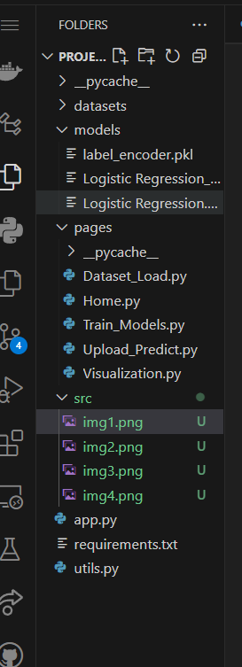
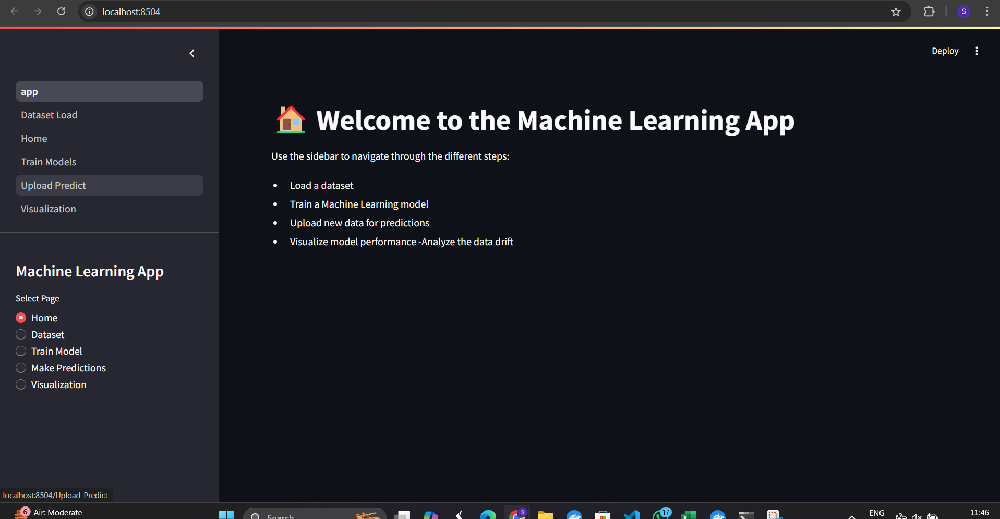
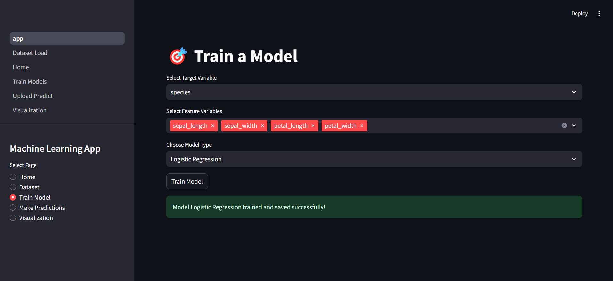
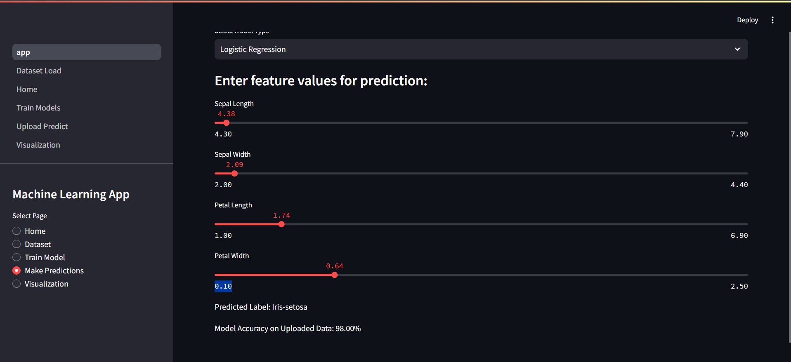
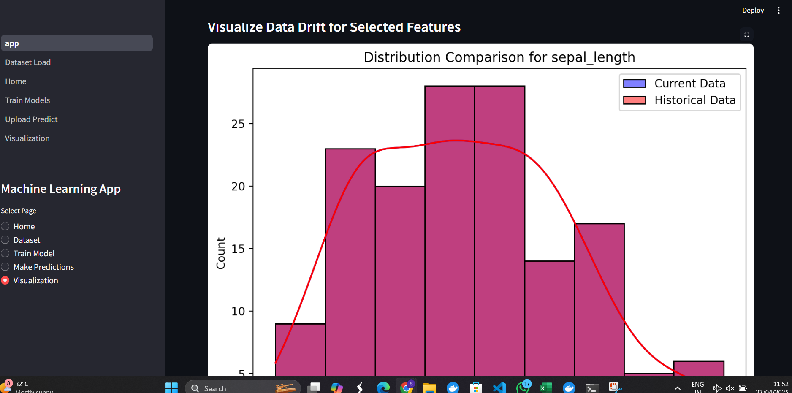

# 🌟 Machine Learning Model Training and Prediction Web App

---

## 🚀 Project Overview

This project is a **Streamlit-based web application** designed to assist users in performing end-to-end machine learning tasks, including:

- **Model Training**: Select and train ML models (Logistic Regression, Random Forest, SVM, XGBoost) on uploaded datasets.
- **Model Prediction**: Upload new data and predict outcomes using saved models.
- **Model Evaluation**: View confusion matrices and accuracy metrics.
- **Data Drift Detection**: (Optional) Detect if the data distribution has changed compared to historical data.
- **Visualization**: Visual tools like confusion matrix plots to understand model performance better.

✅ In short, this project provides a **complete solution** — from model training ➡️ prediction ➡️ evaluation — inside an easy-to-use web app!

---

## ✨ Features

- 📂 **Upload Dataset** for training or prediction.
- 📈 **Train multiple models** and choose the best one.
- 🔥 **Save and load trained models**.
- 🎯 **Make predictions** on new uploaded data.
- 🛠️ **Confusion Matrix** and **Accuracy** visualization.
- 🔍 **Data Drift Detection** (optional, if historical data is provided).

---

# 🗂 Project Directory Structure

Below is the **visual layout** and folder structure of the project:

# My ML Project

This project includes machine learning model training, predictions, and visualization. Below is the layout with images and instructions.
 <!-- Text (Commands) in the second column -->
  

    <h3>Installation and Setup:</h3>
    <pre>
    pip install -r requirements.txt
    </pre>
  

  

    <h3>Running the App:</h3>
    <pre>
    streamlit run app.py
    </pre>
  

.
📸 Screenshots
Here’s what the app looks like:

<h2>➡️ Home Page</h2>
 

<h2>➡️ Dataset Upload</h2>
 

<h2>➡️ Model Training</h2>
 

<h2>➡️ Prediction and Visualization</h2>
 

